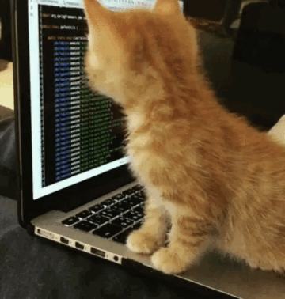

# Meet Our Cool Contributors

| | | | 
|:-------------------------:|:-------------------------:|:-------------------------:|
|  [Harshit Jain](https://github.com/iharshit009 "Made 31 commits") (Mentor) |   [mastershailesh1234](https://github.com/mastershailesh1234 "Made 8 commits") |  [Param Siddharth](https://github.com/paramsiddharth "Made 5 commits")|
  [Ritik Jain](https://github.com/Rits1272 "Made 4 commits")   |    [Chinmay Mehta](https://github.com/chinmaym07 "Made 3 commits") |  [verma-shivani](https://github.com/verma-shivani "Made 2 commits") |
  [Pratya chugh](https://github.com/pratyaa "Made 2 commits")  |    [Sumit Chauhan](https://github.com/codeit13 "Made 4 commits") |  [Masudha Meher](https://github.com/samflab "Made 37 commits") (Mentor) | 
  [Niloy Sikdar](https://github.com/Niloy-Sikdar-001 "Made 5 commits")   |    [Sharmistha Mandal](https://github.com/Sharmi-1999 "Made 11 commits") (Mentor)|  [Hari Ram](https://github.com/hariramjp777 "Made 7 commits") |
  [Nisha Yadav](https://github.com/nisha331 "Made 3 commits")   |    [sagnik008](https://github.com/sagnik008 "Made 2 commits") |  [Shreya Paul](https://github.com/paulshreya "Made 1 commit") |
  [syedmazharaliraza](https://github.com/syedmazharaliraza "Made 4 commits") |   [Ankit Kumar Ghosh](https://github.com/heyankit78 "Made 5 commits") |   [Aniruddha Routh](https://github.com/aniruddha-5 "Made 1 commit") |
  [Avinash Vijayvargiya](https://github.com/avinash14022002 "Made 65 commits") (Mentor)|   [Chinmay Kulkarni](https://github.com/Grandolf49 "Made 35 commits") (Mentor)|   [WhiteSource Renovate](https://github.com/renovate-bot "Made 20 commits") |
  [Tarun Medtiya](https://github.com/tarun42 "Made 8 commits") |   [Chehak Agrawal](https://github.com/chehak123 "Made 18 commits") (Mentor)|   [Priyadarshini Kumari](https://github.com/pawki07 "Made 17 commits") |
  [Lucky kumari](https://github.com/luckykumarirai "Made 3 commits") |   [utpalendubarman](https://github.com/utpalendubarman "Made 5 commits") (Mentor)|   [Karun Karthik](https://github.com/karunkarthik-git "Made 6 commits") |
  [sneha-baser](https://github.com/sneha-baser "Made 1 commit") |   [Niveditha Palli](https://github.com/Niveditha18 "Made 1 commit") |   [Swapna Devi](https://github.com/Swapna804 "Made 1 commit") |
  [Vinit Shahdeo](https://github.com/vinitshahdeo "Made 92 commits") (Mentor)|   [Kashish k](https://github.com/Kashish121 "Made 30 commits") |   [Ishika Dubey](https://github.com/ishika1727 "Made 12 commits") |
  [Sohaib](https://github.com/Sohaib03 "Made 2 commits") |   [Snyk bot](https://github.com/snyk-bot "Made 2 commits") |   [Saurabh](https://github.com/saurabh-33 "Made 1 commit") |
  [Akshita Gupta](https://github.com/akshitagupta15june "Made 165 commits") (Mentor)|   [Aayush Garg](https://github.com/Aayush-hub "Made 65 commits") |   [Smriti](https://github.com/smriti1313 "Made 53 commits") |
  [Harshit Dhyani](https://github.com/Halix267 "Made 44 commits") |   [Vinamrata1086](https://github.com/Vinamrata1086 "Made 10 commits") |   [Soyabul Islam Lincoln](https://github.com/SoyabulIslamLincoln "Made 10 commits") |
  [Sagnik Roy](https://github.com/sagnik1511 "Made 16 commits") |   [Ashwani Rathee](https://github.com/ashwani-rathee "Made 5 commits") |   [Kerin Pithawala](https://github.com/KerinPithawala "Made 4 commits") |
  [Nihar Sanda](https://github.com/koolgax99 "Made 2 commits") |   [Achyut Kumar Panda](https://github.com/Sloth-Panda "Made 9 commits") |   [Sagnik Mazumder](https://github.com/Karnak123 "Made 1 commit") |
  [lipika02](https://github.com/lipika02 "Made 1 commit") |   [Amandeep](https://github.com/amandp13 "Made 2 commits") |   [Hemanth Kollipara](https://github.com/Defcon27 "Made 1 commit") |
  [Bhagyashri2000](https://github.com/Bhagyashri2000 "Made 1 commit") |   [Musavveer Rehaman](https://github.com/musavveer "Made 1 commit") |   [saiharsha-22](https://github.com/saiharsha-22 "Made 12 commits") |
  [Meha Bhalodiya](https://github.com/mehabhalodiya "Made 1 commit") |   [Himanshu](https://github.com/himanshu007-creator "Made 1 commit") |   [RaghavModi](https://github.com/RaghavModi "Made 1 commit") |
  [Samir Rajesh Prajapati](https://github.com/samir-0711 "Made 2 commits") |   [Anushka Gupta](https://github.com/anushka23g "Made 43 commits") (Mentor)|   [Aditi Sneh](https://github.com/aditisneh "Made 2 commits") |
  [Albert Jokelin](https://github.com/Albert-Jokelin "Made 1 commit") |   [Rounak Neogy](https://github.com/RounakNeogy "Made 1 commit") |   [Vaishnavi Shah](https://github.com/vaishnavirshah "Made 1 commit") |
  [Shiv](https://github.com/shivshankar9 "Made 1 commit") |   [singhsaurav23](https://github.com/singhsaurav23 "Made 1 commit") |   [Dibyajyoti Mondal](https://github.com/djm-1 "Made 14 commits") |
  [Rishika Ghosh](https://github.com/RishikaGhosh "Made 1 commit") |   [Sandip Dutta](https://github.com/Dutta-SD "Made 4 commits") |   [Soham Parekh](https://github.com/und3fined-v01d "Made 110 commits") (Mentor)|
  [Vrushti Mody](https://github.com/vrushti-mody "Made 4 commits") |   [Radhika Patwari](https://github.com/rsrkpatwari1234 "Made 16 commits") (Mentor)|   [Muthu Annamalai.V](https://github.com/muthuannamalai12 "Made 4 commits") |
  [Vidit Gupta](https://github.com/vidit624 "Made 4 commits") |   [Tejan Singh](https://github.com/tejan-singh "Made 2 commits") |   [Ananthakrishnan Nair RS](https://github.com/akrish4 "Made 2 commits") |
  [Akash Patel](https://github.com/imakash3011 "Made 1 commit") |   [Tejas1510](https://github.com/Tejas1510 "Made 45 commits") (Mentor)|   [Nikhil Ghodke](https://github.com/nikhilbghodke "Made 7 commits") |
  [Satvik Dandale](https://github.com/SatvikDandale "Made 3 commits") |   [Aadhitya A](https://github.com/alphaX86 "Made 49 commits") (Mentor)|   [Pritam Pawar](https://github.com/pritamp17 "Made 33 commits") |
  [Ayush kumar](https://github.com/Ayush7614 "Made 30 commits") |   [Ganesh C K M](https://github.com/ckmganesh "Made 24 commits") |   [Abhijeet Chatterjee](https://github.com/abhijeet007rocks8 "Made 17 commits") |
  [Advik Singhania](https://github.com/adviksinghania "Made 13 commits") |   [rutvik padhiyar](https://github.com/rutvikpadhiyar000 "Made 10 commits") |   [Mohta Rahul Suresh](https://github.com/Rahul555-droid "Made 9 commits") |
  [devmalik7](https://github.com/devmalik7 "Made 8 commits") |   [Satya Prakash Satyam](https://github.com/N00Bmaster2810 "Made 7 commits") |   [Aakash Goel](https://github.com/aakashgoel2002 "Made 6 commits") |
  [Vaibhav Singhal](https://github.com/iamvs-2002 "Made 5 commits") |   [Nitya](https://github.com/nitya123-github "Made 4 commits") |   [KamalAres](https://github.com/KamalAres "Made 3 commits") |
  [Karan Verma](https://github.com/Detailer "Made 3 commits") |   [yashlad681](https://github.com/yashlad681 "Made 3 commits") |   [nporia](https://github.com/nporia "Made 3 commits") |
  [Pawan Kumar Mishra](https://github.com/pawankm21 "Made 3 commits") |   [Harsh Mangal](https://github.com/slashharsh "Made 3 commits") |   [Siddharth Mohanty](https://github.com/spursbyte "Made 3 commits") |
  [Bobin Mathew](https://github.com/BobinMathew "Made 3 commits") |   [Prateek Tripathy](https://github.com/tripathyprateek "Made 2 commits") |   [ayushi-get](https://github.com/ayushi-get "Made 2 commits") |
  [Anubhab Sarkar](https://github.com/anubhab1710 "Made 2 commits") |   [Nishant Mishra](https://github.com/Nishant2907 "Made 1 commit") |   [Souraprabha Ganguly](https://github.com/noob-26 "Made 1 commit") |
  [Chetan Naik](https://github.com/chetanN02 "Made 1 commit") |   [Zugarfot](https://github.com/Zugarfot "Made 1 commit") |   [Sakshi Khachane](https://github.com/sakshikhachane "Made 1 commit") |
  [Purvansh Singh](https://github.com/Purvanshsingh "Made 1 commit") |   [Kirill-frontend](https://github.com/Kirill-frontend "Made 1 commit") |   [Chitranshu Gour](https://github.com/chitranshu11 "Made 1 commit") |
  [akr](https://github.com/a-k-r-a-k-r "Made 1 commit") |   [Abhay Singh Yadav](https://github.com/abhay313 "Made 1 commit") |   [aryangulati](https://github.com/aryangulati "Made 1 commit") |
  [Tejas Ladhani](https://github.com/Tejas-Ladhani "Made 8 commits") |   [Anush Bhatia](https://github.com/anushbhatia "Made 7 commits") |   [Jahnavi-Jonnalagadda](https://github.com/Jahnavi-Jonnalagadda "Made 3 commits") |
  [Smaranjit Ghose](https://github.com/smaranjitghose "Made 3 commits") (Mentor)|   [Aswin Gopinathan](https://github.com/infiniteoverflow "Made 2 commits") |   [Vrushti Shah](https://github.com/Vrushti24 "Made 2 commits") |
  [Imgbot](https://github.com/ImgBotApp "Made 3 commits") |   [Kanishka Aggarwal](https://github.com/kanishkaa24 "Made 1 commit") |   [tharunc](https://github.com/tharunc "Made 1 commit") |
  [Priyabrata Biswas](https://github.com/fave77 "Made 41 commits") (Mentor)|   [Subhra264](https://github.com/Subhra264 "Made 1 commit") |   [Pranav](https://github.com/Pranav016 "Yet to merge commits") (Mentor) |
  [Priyal Bhatewara](https://github.com/priyalbhatewara123/ "Yet to merge commits") (Mentor)|   [Bindu hite](https://github.com/bindu-07 "Yet to merge commits") (Mentor)|   [purbayankar](https://github.com/purbayankar/ "Yet to merge commits") (Mentor)|
  [Chiraag Kakar](https://github.com/chiraag-kakar "Made 50 commits") (Mentor)|   [Abhra303](https://github.com/Abhra303 "Made 3 commits") |   [Nilisha Jaiswal](https://github.com/nilisha-jais "Made 2 commits") |
  [Ajoy Naskar](https://github.com/magjoy6 "Made 2 commits")|   [S Harshita](https://github.com/harshita2216 "Made 3 commits") |   [Malvika Bhargava](https://github.com/Malvika18 "Made 1 commit") |
  [Aman Prakash Jha](https://github.com/amanjha8100 "Made 1 commit")|   [SAIKAT_CLAW](https://github.com/7saikat7 "Made 1 commit") |   [yogesh](https://github.com/hound77 "Made 10 commits") (Mentor)|
  [V Nikhita](https://github.com/Nikhita28 "Made 2 commits")|   [Janhabi Mukherhjee](https://github.com/Janhabi-Mukherjee "Made 1 commit") |   [shreetama123](https://github.com/shreetama123 "Made 1 commit")|
  [Tushar Jain](https://github.com/tusharjain0022 "Made 1 commit")|
